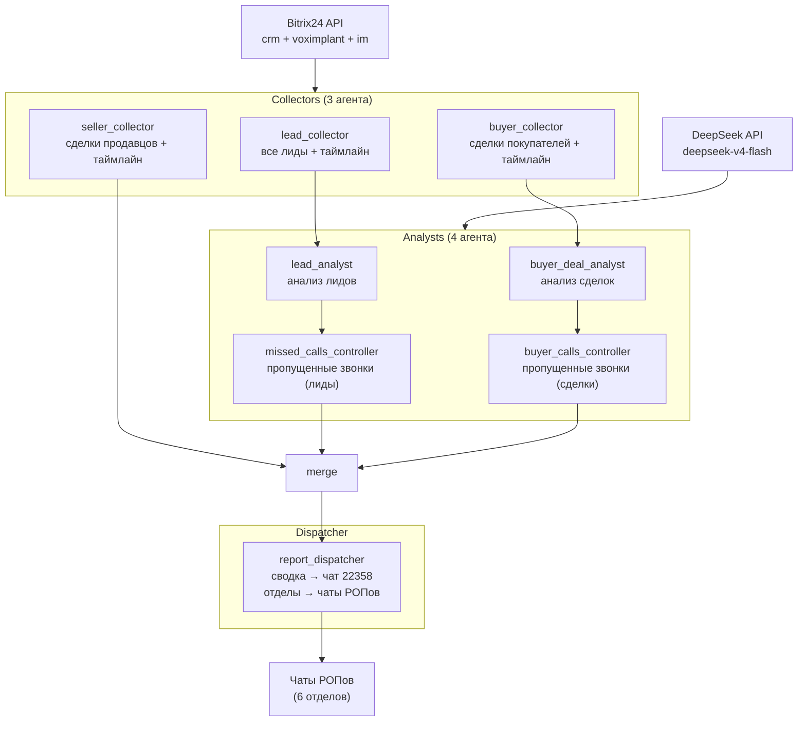

# b24-ai-auditor

AI-аудитор для Битрикс24 на базе LangGraph + DeepSeek API.

Автоматический контроль соблюдения регламента работы с CRM: лиды, сделки покупателей и продавцов, уведомления о нарушениях в чаты РОПов и сводный отчёт руководству.

## Архитектура v2



**Маршрутизация отчётов:** сводка уходит в общий чат (`REPORT_CHAT_ID = 22358` в `graph.py`). Отчёты по отделам — в чаты РОПов (`DEPT_CHAT_MAP`: Кретов, Горяинов, Трофимова, Волкова, Шпырная). Отделы без маппинга пропускаются.

## Стек

- **Язык:** Python 3.11+
- **Оркестрация:** LangGraph
- **LLM:** DeepSeek API (`deepseek-v4-flash`, аналитики лидов и звонков)
- **CRM:** fast_bitrix24
- **Конфигурация:** pydantic-settings + `.env`
- **Деплой:** Docker + cron (пн–пт, 10:00 и 17:00 МСК)

Подробный чеклист деплоя: [DEPLOY.md](DEPLOY.md).

## Быстрый старт

### 1. Клонирование и настройка

```bash
git clone https://github.com/DanilaYukin/AI_agents_CRM.git b24-ai-auditor
cd b24-ai-auditor
python -m venv venv
venv\Scripts\activate        # Windows
# source venv/bin/activate   # Linux
pip install -r requirements-dev.txt
```

### 2. Конфигурация

```bash
copy .env.example .env      # Windows
# cp .env.example .env      # Linux
```

Заполните `.env`: webhook Битрикс24, ключ DeepSeek API, `REPORT_SINCE`, ID воронок.

### 3. Проверка подключения

```bash
python scripts/test_b24.py
```

### 4. Запуск аудита

```powershell
# Windows (PowerShell):
.\make.cmd run
.\make.cmd dry-run

# Linux (если установлен make):
make run
make dry-run
```

## Деплой

### Docker

```bash
docker build -t b24-ai-auditor:latest .
docker run --rm --env-file .env -v $(pwd)/logs:/app/logs b24-ai-auditor:latest
```

### Cron (Linux)

Актуальное расписание: **10:00 и 17:00 МСК** (07:00 и 14:00 UTC), пн–пт.

```bash
# Вариант 1: прямой запуск на хосте
echo "0 7,14 * * 1-5 cd /opt/b24-ai-auditor && venv/bin/python src/main.py >> logs/cron.log 2>&1" | crontab -

# Вариант 2: запуск через Docker
echo "0 7,14 * * 1-5 cd /opt/b24-ai-auditor && docker run --rm --env-file .env -v \$(pwd)/logs:/app/logs b24-ai-auditor:latest >> logs/cron.log 2>&1" | crontab -
```

Или скопировать готовую строку из `crontab.txt`:

```bash
crontab crontab.txt
crontab -l
```

## Переменные окружения

| Переменная | Описание |
|---|---|
| `B24_WEBHOOK_URL` | URL входящего вебхука Битрикс24 |
| `B24_USER_ID` | ID пользователя для API-запросов |
| `BUYERS_CATEGORY_ID` | ID воронки покупателей (по умолчанию 18) |
| `SELLERS_CATEGORY_ID` | ID воронки продавцов (по умолчанию 0) |
| `REPORT_SINCE` | Дата начала отчётного периода (YYYY-MM-DD) |
| `DEEPSEEK_API_KEY` | API-ключ DeepSeek ([platform.deepseek.com](https://platform.deepseek.com)) |
| `DEEPSEEK_BASE_URL` | Базовый URL API (по умолчанию `https://api.deepseek.com`) |
| `DEEPSEEK_MODEL` | Модель для аналитиков (по умолчанию `deepseek-v4-flash`) |
| `DEEPSEEK_V3_MODEL` | Резервная модель (по умолчанию `deepseek-v4-flash`) |
| `DRY_RUN` | `true` — только чтение, без мутаций в CRM |
| `LOG_LEVEL` | Уровень логирования (INFO, DEBUG) |
| `MANAGEMENT_CHAT_ID` | ID чата для сводных отчётов (зарезервировано; сводка сейчас в `graph.py`: 22358) |
| `ADMIN_USER_ID` | ID админа для экстренных уведомлений |

## Makefile / make.cmd

На Windows без GNU Make используйте **`.\make.cmd`**.

| Команда | Описание |
|---|---|
| `.\make.cmd install` | venv + зависимости |
| `.\make.cmd lint` | flake8 |
| `.\make.cmd test` | pytest |
| `.\make.cmd test-b24` | проверка Bitrix24 |
| `.\make.cmd run` | полный аудит |
| `.\make.cmd dry-run` | только чтение |
| `.\make.cmd exclusive-expiry` | напоминания по эксклюзивам |
| `.\make.cmd docker-build` | сборка образа |

## Структура проекта

```
b24-ai-auditor/
├── src/
│   ├── config.py              # Pydantic Settings
│   ├── main.py                # Точка входа аудита
│   ├── tools.py               # Bitrix24 API + правила аудита
│   ├── graph.py               # LangGraph граф v2
│   ├── prompts.py             # Системные промпты LLM
│   ├── notify.py              # Отправка в чаты Bitrix24
│   ├── db.py                  # SQLite (violations, brokers, exclusive)
│   ├── weekly_report.py       # Недельный отчёт по брокерам
│   ├── task_auditor.py        # Просроченные задачи
│   ├── owner_tracker.py       # KPI собственников
│   ├── broker_score.py        # Скоринг брокера
│   ├── chat_poller.py         # Чат-команды
│   └── exclusive_expiry.py    # Напоминания по эксклюзивам
├── tests/
├── logs/
├── data/                      # SQLite + runtime (gitignored)
├── plans/                     # Планы и промпты разработки
├── scripts/
│   ├── list_departments.py
│   └── test_b24.py
├── Dockerfile
├── docker-compose.yml
├── crontab.txt
├── Makefile
├── make.cmd
├── requirements.txt
├── requirements-dev.txt
├── DEPLOY.md
└── README.md
```
