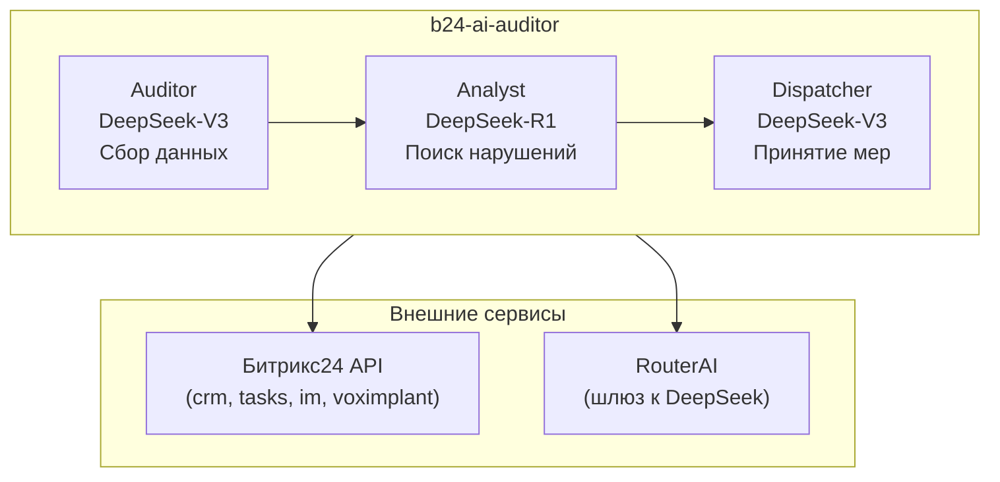

# b24-ai-auditor

AI-аудитор для Битрикс24 на базе LangGraph + DeepSeek (через RouterAI).

Автоматический контроль соблюдения регламента работы с CRM: проверка сделок, звонков, квалификации лидов и уведомление о нарушениях.

## Архитектура



## Стек

- **Язык:** Python 3.11+
- **Оркестрация:** LangGraph
- **LLM:** DeepSeek-R1 (reasoning), DeepSeek-V3 (tool-calling) через RouterAI
- **CRM:** fastbitrix24
- **Конфигурация:** pydantic-settings + .env
- **Деплой:** Docker + cron на Proxmox

## Быстрый старт

### 1. Клонирование и настройка

```bash
git clone <repo-url>
cd b24-ai-auditor
python -m venv venv
venv\Scripts\activate        # Windows
pip install -r requirements-dev.txt
```

### 2. Конфигурация

```bash
copy .env.example .env
# Отредактируйте .env, вставив реальные ключи RouterAI и webhook URL Битрикс24
```

### 3. Проверка подключения

```bash
python src/test_b24.py
```

### 4. Запуск аудита

```powershell
# Windows (PowerShell) — без установки GNU Make:
.\make.cmd run
.\make.cmd dry-run

# Если установлен make (choco install make / winget install GnuWin32.Make):
make run
make dry-run
```

## Деплой

### Docker

```bash
docker build -t b24-ai-auditor:latest .
docker run --rm --env-file .env -v $(pwd)/logs:/app/logs b24-ai-auditor:latest
```

### Cron (Linux)

```bash
# Вариант 1: прямой запуск на хосте
crontab -l > my_crontab
echo "0 9-19/2 * * 1-5 cd /opt/b24-ai-auditor && venv/bin/python src/main.py >> logs/cron.log 2>&1" >> my_crontab
crontab my_crontab

# Вариант 2: запуск через Docker
echo "0 9-19/2 * * 1-5 cd /opt/b24-ai-auditor && docker run --rm --env-file .env -v \$(pwd)/logs:/app/logs b24-ai-auditor:latest >> logs/cron.log 2>&1" >> my_crontab
```

### Proxmox

1. Перенести проект на VM: `scp -r b24-ai-auditor/ user@vm:/opt/`
2. На VM: `cd /opt/b24-ai-auditor && docker build -t b24-ai-auditor .`
3. Настроить cron на хосте: `crontab /opt/b24-ai-auditor/crontab.txt`
4. Мониторинг логов: `tail -f /opt/b24-ai-auditor/logs/audit.log`

## Переменные окружения

| Переменная | Описание |
|---|---|
| `B24_WEBHOOK_URL` | URL входящего вебхука Битрикс24 |
| `B24_USER_ID` | ID пользователя для API-запросов |
| `ROUTERAI_API_KEY` | API-ключ RouterAI |
| `ROUTERAI_BASE_URL` | Базовый URL RouterAI (по умолчанию `https://routerai.ru/api/v1`) |
| `ROUTERAI_R1_MODEL` | Модель для Analyst (по умолчанию `deepseek/deepseek-v4-flash`) |
| `ROUTERAI_V3_MODEL` | Модель для Auditor/Dispatcher (по умолчанию `deepseek/deepseek-v4-flash`) |
| `DRY_RUN` | `true` — только чтение, без мутаций |
| `LOG_LEVEL` | Уровень логирования (INFO, DEBUG, WARNING) |
| `MANAGEMENT_CHAT_ID` | ID чата для отчётов руководству |
| `ADMIN_USER_ID` | ID админа для экстренных уведомлений |

## Makefile команды

На Windows в PowerShell по умолчанию нет `make` — используйте **`.\make.cmd`** (те же цели, что в `Makefile`).

| Команда | Описание |
|---|---|
| `.\make.cmd install` | Создать venv и установить зависимости |
| `.\make.cmd lint` | Проверить стиль кода (flake8) |
| `.\make.cmd test` | Запустить тесты |
| `.\make.cmd test-b24` | Проверить подключение к Битрикс24 |
| `.\make.cmd run` | Запустить аудит |
| `.\make.cmd dry-run` | Запустить аудит в режиме "только чтение" |
| `.\make.cmd docker-build` | Собрать Docker-образ |

## Структура проекта

```
b24-ai-auditor/
├── .cursor/
│   └── rules            # Правила для Cursor AI
├── src/
│   ├── config.py        # Pydantic Settings
│   ├── main.py          # Точка входа
│   ├── tools.py         # Инструменты (fastbitrix24)
│   ├── graph.py         # LangGraph граф
│   └── prompts.py       # Системные промпты
├── tests/
├── logs/
├── Dockerfile
├── docker-compose.yml
├── crontab.txt
├── Makefile
├── make.cmd             # Обёртка для Windows (PowerShell без make)
└── requirements.txt
```
