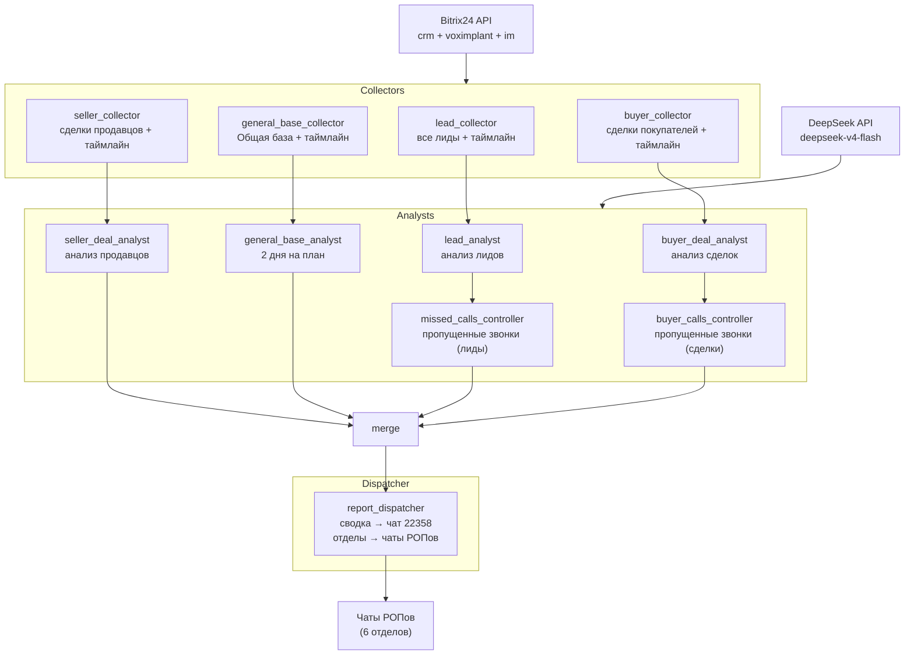

# b24-ai-auditor

AI-аудитор для Битрикс24 на базе LangGraph + DeepSeek API.

Автоматический контроль соблюдения регламента работы с CRM: лиды, сделки покупателей и продавцов, уведомления о нарушениях в чаты РОПов и сводный отчёт руководству.

## Архитектура v2



> **Важно:** аналитики основного аудита — детерминированные (Python), LLM (DeepSeek) используется только в контроле качества квалификации лидов (`lead_quality_audit.py`).

**Маршрутизация отчётов:** сводка уходит в общий чат (`REPORT_CHAT_ID = 22358` в `graph.py`). Отчёты по отделам — в чаты РОПов (`DEPT_CHAT_MAP`: Кретов, Горяинов, Трофимова, Волкова, Шпырная). Отделы без маппинга пропускаются.

## Стек

- **Язык:** Python 3.11+
- **Оркестрация:** LangGraph
- **LLM:** DeepSeek API (`deepseek-v4-flash`, аналитики лидов и звонков)
- **CRM:** fast_bitrix24
- **Конфигурация:** pydantic-settings + `.env`
- **Деплой:** Docker + cron (пн–пт, 10:00 и 17:00 МСК)

Подробный чеклист деплоя: [DEPLOY.md](DEPLOY.md).

## Аналитический дашборд

Веб-дашборд по воронкам на `pars.afina-crm.ru/dashboard` — движение лидов и
сделок, конверсии, деньги, разложение до карточек Bitrix.

Данные берутся не из Bitrix напрямую, а из витрины `data/analytics.db`,
которую наполняет ETL: движение по стадиям невозможно восстановить из текущего
состояния сделки — `crm.deal.list` знает только, где она сейчас. Историю даёт
`crm.stagehistory.list`, и её надо накапливать.

```
Bitrix24 REST ──(cron /15 мин)──> ETL ──> data/analytics.db ──> FastAPI ──> nginx+TLS
                              src/analytics/                     src/web/    /dashboard
```

Быстрый старт:

```bash
python src/web/manage.py gen-secret >> .env   # ключ подписи сессий
python src/analytics/etl.py --probe           # проверить доступ к API
python src/analytics/etl.py --backfill        # первичная загрузка за 12 месяцев
python src/web/manage.py adduser director     # завести пользователя
python src/web/server.py                      # http://127.0.0.1:8080/dashboard/
```

Доступ разграничен: администратор видит всю компанию, РОП — только свои
отделы. Ограничение задаётся на уровне соединения с витриной, а не фильтром в
каждом запросе, поэтому новый запрос получает его автоматически. Роль по
умолчанию — минимальная: забытый флаг создаёт пользователя, который не видит
ничего, а не администратора.

Что важно знать про цифры:

- **Срез и когорта — разные вещи.** «Сколько стоит на стадии сейчас» отвечает
  на вопрос загрузки, «сколько сделок периода когда-либо дошли до стадии» — на
  вопрос денег. На дашборде они разведены и подписаны, потому что смешение
  этих двух — типовой способ принять дорогое неправильное решение.
- **У каждой суммы есть покрытие.** Поле «Комиссия» заполнено не везде, и
  «12,4 млн ₽» без приписки «заполнено у 68% сделок» вводит в заблуждение ровно
  там, где решается вопрос о деньгах.
- **Пороги берутся из своих данных.** «Зависшая сделка» — та, что стоит дольше
  75-го перцентиля своей же стадии, а не дольше выдуманного числа дней.

### Раздел «Объекты»: данные из Афины CRM

Единственная страница дашборда, которая читает не витрину, а другую систему.
Афина отдаёт для неё отдельную read-only витрину `/api/public/dashboard/*` —
тот же ключ, что у публичного каталога сайта (`X-API-Key`), но другой
контракт: статусы, причины снятия и даты событий каталог намеренно не
показывает.

```
Афина CRM ──(X-API-Key, только сервер)──> FastAPI ──> /dashboard/objects
/api/public/dashboard/*                    src/web/afina.py
```

Что на странице: счётчики (всего, в рекламе, на сайте, сняты), список
объектов с датами публикации, продления и снятия, причина снятия отдельно от
комментария, брокер, отдел и рекламный аккаунт — и вторым видом история
снятий за период, где причина берётся на момент события.

Как это считается. Афина умеет фильтровать только по статусу, сайту и
рекламному аккаунту — ни отдела, ни брокера, ни дат в параметрах `/listings`
нет, хотя все эти поля в карточке лежат. Поэтому раз в минуту берётся снимок
рабочих объектов (в рекламе, на сайте, снятые с рекламы — меньше тысячи
карточек), а отделы, брокеры и периоды считаются по нему локально.
Переключение чипов, отделов и периодов после этого не стоит ни одного запроса.

Чип выбирает, о чём таблица ниже и что считается за период; плитки он не
сужает — иначе «Сняты с рекламы» под фильтром «в рекламе» всегда показывали бы
ноль. Отдел и поиск сужают всё сразу. Фильтр «Все» живёт отдельно: там 38 тысяч
карточек, снимком их не собрать, поэтому показываются только счётчики
`/summary` — без периода, отделов и разбивки.

Плитка события за период показывает прирост к предыдущему периоду той же
длины — как остальные метрики дашборда. От нуля процент не считается: рост с
нуля до пяти это не «+500%», а «в прошлом периоде не было», так и написано.

Остальные плитки и колонки таблицы подписаны словом «сейчас» и за периодом не
следуют — это состояние, а не события. Истории статусов Афина не хранит, и
«сколько было в рекламе 1 августа» узнать неоткуда; без пометки неподвижное
число при переключении дат читается как поломка. В чипе «Сняты с рекламы»
плитки состояния снятых нет вовсе: она стояла вплотную к «Снято с рекламы за
период», и два числа про один предмет — одно подвижное, другое нет — сбивали
с толку сильнее, чем помогали.

Снятие засчитывается, только если у него есть причина, и «Другое» без
пояснения не в счёт: брокер выбрал пункт и ничего не написал. Требовать
комментарий от всех причин нельзя — у словарных («Продано нами», «Задаток
наш») его нет по устройству Афины, и тогда не засчитывалось бы ничего.

Снятие с сайта Афина хранит только состоянием (`site_sync_status`), даты у него
нет ни в поле, ни в журнале, поэтому «Сняты с сайта» — всегда про «сейчас».

Настройка — две переменные в `.env`:

```bash
AFINA_API_BASE_URL=https://afina-crm.ru
AFINA_API_KEY=<значение PUBLIC_API_KEY на стороне Афины>
```

Проверить связь до запуска дашборда:

```bash
curl -H "X-API-Key: $AFINA_API_KEY" \
  https://afina-crm.ru/api/public/dashboard/summary
```

Чего от раздела ждать не надо:

- **Без ключа раздела нет.** Пустой `AFINA_API_KEY` убирает и страницу, и
  пункт меню: пункт, ведущий на «не настроено», не отличить от поломки.
- **Раздел открыт только администратору.** Отделы у Афины свои, сопоставить
  их с отделами Битрикса нечем, а значит нельзя и сузить выдачу до своего
  отдела — как это сделано для витрины. Открыть его РОПам — снять проверку
  `is_admin` в `routes_pages.objects`, но тогда РОП увидит брокеров всей
  компании.
- **Счётчики не складываются.** Объект бывает одновременно в рекламе и на
  сайте, поэтому `in_ad + is_published + removed_from_ad` — не `total`.
- **Копии не схлопываются.** Одна квартира в двух рекламных аккаунтах — две
  строки; вторая помечена как копия. Это не дубль: снять их могут порознь.
- **Причина снятия показывается только у снятых.** Афина не чистит поле при
  возврате объекта в рекламу, и старая причина рядом со статусом «В рекламе»
  была бы неправдой. Точная картина на момент события — во вкладке «Снятия».
- **Снятия по истечению срока в историю не попадают.** Автоматическое снятие
  Афина в журнал не пишет: такой объект виден в списке «Сняты с рекламы», но
  не во вкладке «Снятия».
- **Молчащая Афина не роняет страницу.** Она отрисуется с плашкой, что
  источник недоступен.

CORS настраивать не нужно: в Афину ходит сервер дашборда, а не браузер —
браузеру это и запрещено политикой CSP (`connect-src 'self'`).

Детали установки, nginx и проверки после развёртывания: [DEPLOY.md](DEPLOY.md).

Как устроен каждый аудит, какие правила проверяются и по какому расписанию запускаются задачи: [plans/AUDITS.md](plans/AUDITS.md).

## Быстрый старт

### 1. Клонирование и настройка

```bash
git clone https://github.com/Usachevofishial-git/AI_agents_Bitrix24.git b24-ai-auditor
cd b24-ai-auditor
python -m venv venv
venv\Scripts\activate        # Windows
# source venv/bin/activate   # Linux
pip install -r requirements-dev.txt
```

### 2. Конфигурация

```bash
copy .env.example .env      # Windows
# cp .env.example .env      # Linux
```

Заполните `.env`: webhook Битрикс24, ключ DeepSeek API, `REPORT_SINCE`, ID воронок.

### 3. Проверка подключения

```bash
python scripts/test_b24.py
```

### 4. Запуск аудита

```powershell
# Windows (PowerShell):
.\make.cmd run
.\make.cmd dry-run

# Linux (если установлен make):
make run
make dry-run
```

## Деплой

### Docker

```bash
docker build -t b24-ai-auditor:latest .
docker run --rm --env-file .env -v $(pwd)/logs:/app/logs b24-ai-auditor:latest
```

### Cron (Linux)

Актуальное расписание: **10:00 и 17:00 МСК** (07:00 и 14:00 UTC), пн–пт.

```bash
# Вариант 1: прямой запуск на хосте
echo "0 7,14 * * 1-5 cd /opt/b24-ai-auditor && venv/bin/python src/main.py >> logs/cron.log 2>&1" | crontab -

# Вариант 2: запуск через Docker
echo "0 7,14 * * 1-5 cd /opt/b24-ai-auditor && docker run --rm --env-file .env -v \$(pwd)/logs:/app/logs b24-ai-auditor:latest >> logs/cron.log 2>&1" | crontab -
```

Или скопировать готовую строку из `crontab.txt`:

```bash
crontab crontab.txt
crontab -l
```

## Переменные окружения

| Переменная | Описание |
|---|---|
| `B24_WEBHOOK_URL` | URL входящего вебхука Битрикс24 |
| `B24_USER_ID` | ID пользователя для API-запросов |
| `BUYERS_CATEGORY_ID` | ID воронки покупателей (по умолчанию 18) |
| `SELLERS_CATEGORY_ID` | ID воронки продавцов (по умолчанию 0) |
| `REPORT_SINCE` | Дата начала отчётного периода (YYYY-MM-DD) |
| `DEEPSEEK_API_KEY` | API-ключ DeepSeek ([platform.deepseek.com](https://platform.deepseek.com)) |
| `DEEPSEEK_BASE_URL` | Базовый URL API (по умолчанию `https://api.deepseek.com`) |
| `DEEPSEEK_MODEL` | Модель для аналитиков (по умолчанию `deepseek-v4-flash`) |
| `DEEPSEEK_V3_MODEL` | Резервная модель (по умолчанию `deepseek-v4-flash`) |
| `DRY_RUN` | `true` — только чтение, без мутаций в CRM |
| `LOG_LEVEL` | Уровень логирования (INFO, DEBUG) |
| `MANAGEMENT_CHAT_ID` | ID чата для сводных отчётов (зарезервировано; сводка сейчас в `graph.py`: 22358) |
| `ADMIN_USER_ID` | ID админа для экстренных уведомлений |
| `ANALYTICS_DB_PATH` | Файл витрины (по умолчанию `data/analytics.db`) |
| `ANALYTICS_MONTHS_BACK` | Глубина истории при первичной загрузке |
| `DASHBOARD_SECRET_KEY` | Ключ подписи сессий. Без него дашборд не стартует |
| `DASHBOARD_COOKIE_SECURE` | `true` в проде; `false` только для отладки по http |
| `AFINA_API_BASE_URL` | Корень сервиса Афины CRM, без пути (по умолчанию `https://afina-crm.ru`) |
| `AFINA_API_KEY` | Ключ витрины объектов Афины. Пусто — раздела «Объекты» нет |
| `AFINA_API_TIMEOUT_SECONDS` | Таймаут запроса к Афине (по умолчанию 10) |
| `AFINA_API_PAGE_SIZE` | Размер страницы выдачи, потолок Афины — 100 |
| `AFINA_CRM_HOST_ENTRY` | `имя:адрес` для hosts контейнера, если Афина на другом хосте |

Полный список с пояснениями — в `.env.example`.

## Makefile / make.cmd

На Windows без GNU Make используйте **`.\make.cmd`**.

| Команда | Описание |
|---|---|
| `.\make.cmd install` | venv + зависимости |
| `.\make.cmd lint` | flake8 |
| `.\make.cmd test` | pytest |
| `.\make.cmd test-b24` | проверка Bitrix24 |
| `.\make.cmd run` | полный аудит |
| `.\make.cmd dry-run` | только чтение |
| `.\make.cmd exclusive-expiry` | напоминания по эксклюзивам |
| `.\make.cmd docker-build` | сборка образа |
| `make etl` / `etl-full` / `etl-backfill` | загрузка витрины |
| `make dashboard` | запуск веб-дашборда |
| `make dashboard-adduser USER_LOGIN=...` | завести пользователя дашборда |

## Структура проекта

```
b24-ai-auditor/
├── src/
│   ├── config.py              # Pydantic Settings
│   ├── main.py                # Точка входа аудита
│   ├── tools.py               # Bitrix24 API + правила аудита
│   ├── graph.py               # LangGraph граф v2
│   ├── prompts.py             # Системные промпты LLM
│   ├── notify.py              # Отправка в чаты Bitrix24
│   ├── db.py                  # SQLite (violations, brokers, exclusive)
│   ├── weekly_report.py       # Недельный отчёт по брокерам
│   ├── task_auditor.py        # Просроченные задачи
│   ├── owner_tracker.py       # KPI собственников
│   ├── broker_score.py        # Скоринг брокера
│   ├── chat_poller.py         # Чат-команды
│   ├── exclusive_expiry.py    # Напоминания по эксклюзивам
│   ├── analytics/             # Витрина: ETL из Bitrix + метрики
│   │   ├── schema.py          #   схема data/analytics.db
│   │   ├── client.py          #   REST-клиент с лимитом темпа и повторами
│   │   ├── stages.py          #   лента пребывания на стадиях
│   │   ├── etl.py             #   backfill / incremental / full
│   │   └── metrics.py         #   определения всех цифр дашборда
│   └── web/                   # Дашборд: FastAPI + Jinja2 + SVG-графики
│       ├── security.py        #   запрет по умолчанию, сессии, CSRF
│       ├── manage.py          #   управление пользователями
│       └── templates/, static/
├── tests/
├── logs/
├── data/                      # SQLite + runtime (gitignored)
├── plans/                     # Планы и промпты разработки
├── scripts/
│   ├── list_departments.py
│   └── test_b24.py
├── Dockerfile
├── docker-compose.yml
├── crontab.txt
├── Makefile
├── make.cmd
├── requirements.txt
├── requirements-dev.txt
├── DEPLOY.md
└── README.md
```
