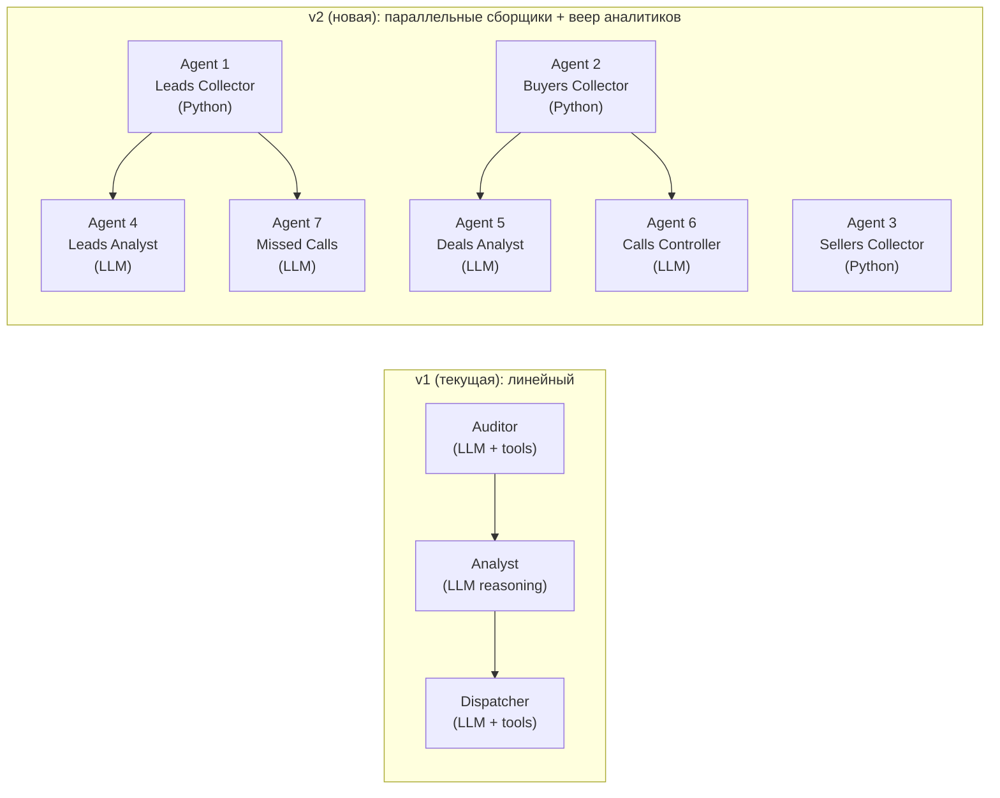
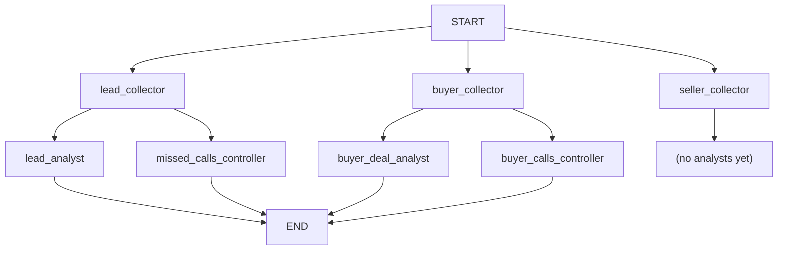

# Архитектура v2: Многоагентный аудит CRM (7 агентов)

## Сравнение: текущая vs новая архитектура



## Ключевые отличия

| Аспект | v1 | v2 |
|---|---|---|
| Сборщики | 1 LLM-агент (медленно, через ReAct) | 3 Python-узла (быстро, прямые API-вызовы) |
| Аналитики | 1 универсальный | 4 специализированных |
| Исполнение | Последовательное | Параллельные сборщики + параллельные аналитики |
| State | `CRMState` (collected_data) | `AuditState` (3 отдельных коллекции) |
| Сложность промптов | 1 универсальный промпт на всё | 4 узких доменных промпта |

## AuditState

```python
class AuditState(TypedDict, total=False):
    raw_leads: list[dict[str, Any]]              # Agent 1
    raw_buyers_deals: list[dict[str, Any]]       # Agent 2
    raw_sellers_deals: list[dict[str, Any]]      # Agent 3
    violations: list[dict[str, Any]]             # Agents 4-7 (накопительно)
    current_time: str                            # ISO 8601
    dry_run: bool
    status: str
    messages: list[str]
```

## Инструменты (добавить в tools.py)

| # | Инструмент | API-метод | Назначение |
|---|---|---|---|
| T1 | `get_all_leads_with_timeline()` | `crm.lead.list` → `crm.timeline.comment.list` на каждый | Agent 1 |
| T2 | `get_deals_by_funnel_with_timeline(category_id)` | `crm.deal.list` (filter: CATEGORY_ID) → `crm.timeline.comment.list` на каждый | Agent 2, 3 |
| T3 | `get_deal_activities(deal_id)` | `crm.activity.list` | Agent 5 (Показ) |
| T4 | `get_lead_timeline_full(lead_id)` | `crm.timeline.comment.list` + `voximplant.statistic.get` | Agent 7 |

## Граф (fan-out)



В LangGraph это делается через `Send` API:
```python
from langgraph.graph import START, END, StateGraph
from langgraph.constants import Send

# Параллельные сборщики
graph.add_edge(START, "lead_collector")
graph.add_edge(START, "buyer_collector")
graph.add_edge(START, "seller_collector")

# Fan-out: один сборщик → несколько аналитиков
graph.add_conditional_edges(
    "lead_collector",
    lambda s: [Send("lead_analyst", s), Send("missed_calls_controller", s)],
)
# ... аналогично для buyer_collector
```

## План файлов

| Файл | Действие | Что переиспользовать |
|---|---|---|
| `src/config.py` | Без изменений | Settings, setup_logging |
| `src/tools.py` | Добавить T1–T4, сохранить старые инструменты | `_get_bitrix`, `_parse_b24_datetime`, `_as_list`, хелперы |
| `src/prompts.py` | Заменить на 4 новых промпта (AN4–AN7) | Ничего |
| `src/graph.py` | Полностью переписать (7 узлов + fan-out) | `_make_r1_llm`, `_make_v3_llm`, `_parse_violations_json`, `_message_content_to_str` |
| `src/main.py` | Обновить вызов run_audit | CLI-обёртка |
| `tests/` | Новые тесты | conftest.py |

## Открытые вопросы (нужно уточнить)

1. **Sellers (Agent 3)**: какие аналитики для сделок продавцов? Или они просто собираются "на будущее"?
2. **CATEGORY_ID**: какие ID у воронок "Покупатели" и "Продавцы (Собственники)" в вашем Битрикс24? Нужно добавить в `.env` (`BUYERS_CATEGORY_ID`, `SELLERS_CATEGORY_ID`).
3. **Dispatcher**: нужен ли после аналитиков? Или только отчёт с violations?
4. **Дела (Activities)**: для этапа "Показ" нужен `crm.activity.list`. Есть ли доступ к этому методу в вебхуке?
5. **Таймлайн звонков**: текущий `voximplant.statistic.get` фильтрует по `CALL_TYPE=1` (исходящие). Для Agent 7 нужны входящие пропущенные — это другой фильтр.
