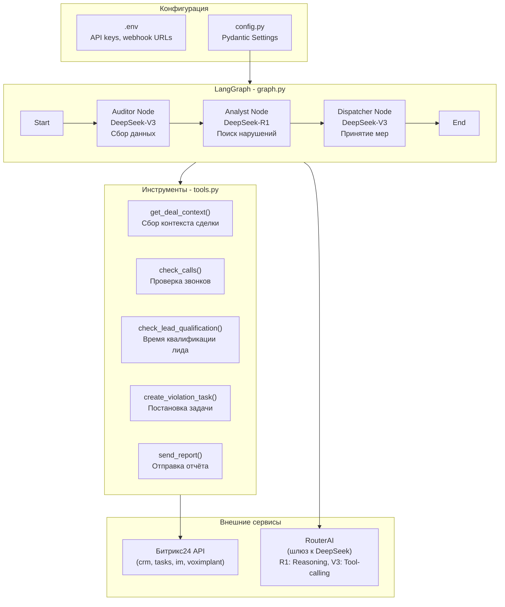

# Архитектура проекта `b24-ai-auditor`

## Общая схема



---

## Структура директорий

```
b24-ai-auditor/
├── .cursor/
│   └── rules                    # Правила для Cursor AI
├── src/
│   ├── __init__.py
│   ├── config.py                # Pydantic Settings (чтение .env)
│   ├── main.py                  # Точка входа
│   ├── tools.py                 # Инструменты (fastbitrix24)
│   ├── graph.py                 # LangGraph граф + узлы агентов
│   └── prompts.py               # Системные промпты для DeepSeek
├── tests/
│   ├── __init__.py
│   └── test_tools.py
├── logs/                        # Логи (в .gitignore)
├── .env.example
├── .gitignore
├── pyproject.toml               # Зависимости + конфиг ruff/mypy
├── requirements.txt             # Фиксация версий для Docker
├── README.md
├── Makefile                     # Команды: install, lint, test, run, dry-run
└── Dockerfile
```

---

## Системные файлы — Этап 0

### 0.1 `.cursor/rules` — Полный свод правил

**Содержание:**

1. **Код-стайл Python:**
   - PEP8 + Ruff (замена flake8/isort/black)
   - Все функции должны иметь type hints
   - Все публичные функции/классы — docstrings (Google style)
   - Максимальная длина строки: 100 символов
   - Именование: snake_case для функций/переменных, PascalCase для классов

2. **Структура проекта:**
   - Весь код приложения — в `src/`
   - Тесты — в `tests/`, зеркально структуре `src/`
   - Конфигурация — через Pydantic BaseSettings из `.env`
   - Промпты — в отдельном модуле `prompts.py`

3. **Соглашения по LangGraph/агентам:**
   - Каждый узел графа — отдельная async-функция
   - Состояние графа — TypedDict `CRMState`
   - Инструменты — синхронные функции, оборачиваются в `@tool` декоратор LangChain
   - Все вызовы LLM — через `ChatOpenAI` с compatible API (DeepSeek)
   - R1 (reasoning) используется только для Analyst узла
   - V3 (tool-calling) используется для Auditor и Dispatcher узлов

4. **Формат коммитов (Conventional Commits):**
   - `feat:` — новая функциональность
   - `fix:` — исправление ошибки
   - `refactor:` — рефакторинг
   - `docs:` — документация
   - `test:` — тесты
   - `chore:` — рутинные задачи (зависимости, конфигурация)
   - Пример: `feat: add get_deal_context tool with timeline comments`

5. **Именование веток:**
   - `main` — production-ready код
   - `develop` — интеграционная ветка
   - `feature/<описание>` — новые фичи (напр. `feature/deal-auditor-node`)
   - `fix/<описание>` — исправления
   - `release/<версия>` — релизные ветки

### 0.2 `.gitignore`

Игнорируемые файлы:
- `.env` (секреты)
- `venv/`, `__pycache__/`, `*.pyc`
- `logs/`
- `.mypy_cache/`, `.ruff_cache/`
- `dist/`, `*.egg-info/`
- `.vscode/` (кроме общих настроек)

### 0.3 `.env.example`

```ini
# Bitrix24
B24_WEBHOOK_URL=https://your-domain.bitrix24.ru/rest/1/your-webhook-code/
B24_USER_ID=1

# RouterAI (российский шлюз к DeepSeek)
ROUTERAI_API_KEY=sk-your-routerai-key
ROUTERAI_BASE_URL=https://routerai.ru/api/v1
ROUTERAI_R1_MODEL=deepseek/deepseek-reasoner
ROUTERAI_V3_MODEL=deepseek/deepseek-chat

# Режим работы
DRY_RUN=true
LOG_LEVEL=INFO

# Уведомления
MANAGEMENT_CHAT_ID=chat12345
ADMIN_USER_ID=1
```

### 0.4 `setup.py`

```python
from setuptools import setup, find_packages

setup(
    name="b24-ai-auditor",
    version="0.1.0",
    description="AI-аудитор для Битрикс24 на LangGraph + DeepSeek",
    packages=find_packages(where="src"),
    package_dir={"": "src"},
    python_requires=">=3.11",
    install_requires=[
        "langgraph>=0.2.0",
        "langchain-openai>=0.2.0",
        "fastbitrix24>=0.3.0",
        "python-dotenv>=1.0.0",
        "pydantic-settings>=2.0.0",
    ],
)
```

### 0.4b `requirements.txt`

```
langgraph>=0.2.0
langchain-openai>=0.2.0
fastbitrix24>=0.3.0
python-dotenv>=1.0.0
pydantic-settings>=2.0.0
```

### 0.4c `requirements-dev.txt`

```
-r requirements.txt
flake8>=7.0.0
pytest>=8.0.0
pytest-asyncio>=0.24.0
```

### 0.5 `Makefile`

```makefile
.PHONY: install lint test run dry-run docker-build

install:
	python -m venv venv
	venv\Scripts\pip install -r requirements.txt
	venv\Scripts\pip install -r requirements-dev.txt

lint:
	venv\Scripts\flake8 src/ tests/

test:
	venv\Scripts\pytest tests/ -v

run:
	venv\Scripts\python src/main.py

dry-run:
	set DRY_RUN=true && venv\Scripts\python src/main.py

docker-build:
	docker build -t b24-ai-auditor:latest .
```

### 0.6 Заглушки модулей (`src/`)

- `__init__.py` — пустой
- `config.py` — класс `Settings(BaseSettings)` с полями из `.env`
- `main.py` — `async def main(): ...` + `asyncio.run(main())`
- `tools.py` — заглушки 5 функций-инструментов с `raise NotImplementedError`
- `graph.py` — заглушка `CRMState` и `build_graph()`
- `prompts.py` — константы `AUDITOR_SYSTEM_PROMPT`, `ANALYST_SYSTEM_PROMPT`, `DISPATCHER_SYSTEM_PROMPT`

### 0.7 `.cursor/rules` (дополнение по линтерам)

Поскольку используем старый стиль (`setup.py` + `requirements.txt`), инструменты линтинга:
- **flake8** — проверка стиля (PEP8) с максимальной длиной строки 100
- Линтинг запускается через `make lint`
- Жёсткая типизация через type hints обязательна, но без автоматической проверки mypy

---

## Этапы 1–5 — Краткий обзор

| Этап | Название | Ключевые артефакты |
|------|----------|---------------------|
| 1 | Окружение и коннекторы | `venv`, `test_b24.py`, проверка `.env` |
| 2 | Инструменты (`tools.py`) | 3 инструмента сбора данных + 2 инструмента действий |
| 3 | LangGraph (`graph.py`) | `CRMState`, узлы Auditor/Analyst/Dispatcher, граф |
| 4 | Тестирование | Dry Run, логирование, проверка на 3-5 сделках |
| 5 | Деплой | `Dockerfile`, `crontab`, мониторинг |
