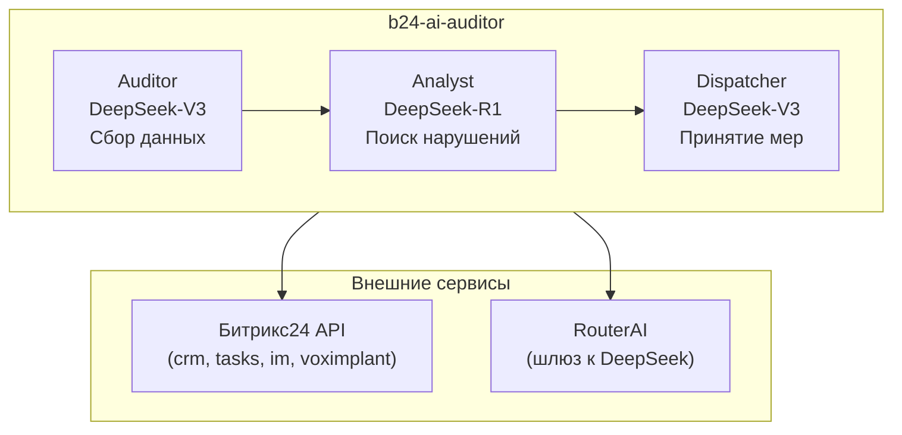

# Промпт для Cursor — Создание `README.md` и `Makefile`

> Скопируйте содержимое ниже и отправьте в Cursor (Agent mode). Создаёт 2 файла в корне проекта.

---

Создай два файла в корне проекта:

## Файл 1: `README.md`

README для русскоязычного проекта с описанием, архитектурой и инструкциями по развёртыванию.

Содержание (markdown, UTF-8):

```markdown
# b24-ai-auditor

AI-аудитор для Битрикс24 на базе LangGraph + DeepSeek (через RouterAI).

Автоматический контроль соблюдения регламента работы с CRM: проверка сделок, звонков, квалификации лидов и уведомление о нарушениях.

## Архитектура



## Стек

- **Язык:** Python 3.11+
- **Оркестрация:** LangGraph
- **LLM:** DeepSeek-R1 (reasoning), DeepSeek-V3 (tool-calling) через RouterAI
- **CRM:** fastbitrix24
- **Конфигурация:** pydantic-settings + .env
- **Деплой:** Docker + cron на Proxmox

## Быстрый старт

### 1. Клонирование и настройка

```bash
git clone <repo-url>
cd b24-ai-auditor
python -m venv venv
venv\Scripts\activate        # Windows
pip install -r requirements-dev.txt
```

### 2. Конфигурация

```bash
copy .env.example .env
# Отредактируйте .env, вставив реальные ключи RouterAI и webhook URL Битрикс24
```

### 3. Проверка подключения

```bash
python src/test_b24.py
```

### 4. Запуск аудита

```bash
# Полный прогон
make run

# Dry Run (только чтение, без мутаций в CRM)
make dry-run
```

## Переменные окружения

| Переменная | Описание |
|---|---|
| `B24_WEBHOOK_URL` | URL входящего вебхука Битрикс24 |
| `B24_USER_ID` | ID пользователя для API-запросов |
| `ROUTERAI_API_KEY` | API-ключ RouterAI |
| `ROUTERAI_BASE_URL` | Базовый URL RouterAI (по умолчанию `https://routerai.ru/api/v1`) |
| `ROUTERAI_R1_MODEL` | Модель для Analyst (по умолчанию `deepseek/deepseek-reasoner`) |
| `ROUTERAI_V3_MODEL` | Модель для Auditor/Dispatcher (по умолчанию `deepseek/deepseek-chat`) |
| `DRY_RUN` | `true` — только чтение, без мутаций |
| `LOG_LEVEL` | Уровень логирования (INFO, DEBUG, WARNING) |
| `MANAGEMENT_CHAT_ID` | ID чата для отчётов руководству |
| `ADMIN_USER_ID` | ID админа для экстренных уведомлений |

## Makefile команды

| Команда | Описание |
|---|---|
| `make install` | Создать venv и установить зависимости |
| `make lint` | Проверить стиль кода (flake8) |
| `make test` | Запустить тесты |
| `make run` | Запустить аудит |
| `make dry-run` | Запустить аудит в режиме "только чтение" |
| `make docker-build` | Собрать Docker-образ |

## Структура проекта

```
b24-ai-auditor/
├── .cursor/
│   └── rules            # Правила для Cursor AI
├── src/
│   ├── config.py        # Pydantic Settings
│   ├── main.py          # Точка входа
│   ├── tools.py         # Инструменты (fastbitrix24)
│   ├── graph.py         # LangGraph граф
│   └── prompts.py       # Системные промпты
├── tests/
├── logs/
├── Dockerfile
├── Makefile
└── requirements.txt
```
```

## Файл 2: `Makefile`

Makefile для Windows (cmd.exe) с основными командами:

```makefile
.PHONY: install lint test run dry-run docker-build

install:
	python -m venv venv
	venv\Scripts\pip install -r requirements.txt
	venv\Scripts\pip install -r requirements-dev.txt

lint:
	venv\Scripts\flake8 src/ tests/

test:
	venv\Scripts\pytest tests/ -v

run:
	venv\Scripts\python src/main.py

dry-run:
	set DRY_RUN=true && venv\Scripts\python src/main.py

docker-build:
	docker build -t b24-ai-auditor:latest .
```

**Требования:**
- Оба файла в кодировке UTF-8
- Переносы строк: LF
- README должен содержать Mermaid-диаграмму
- Makefile использует Windows-синтаксис (`venv\Scripts\...`, `set VAR=value &&`)
