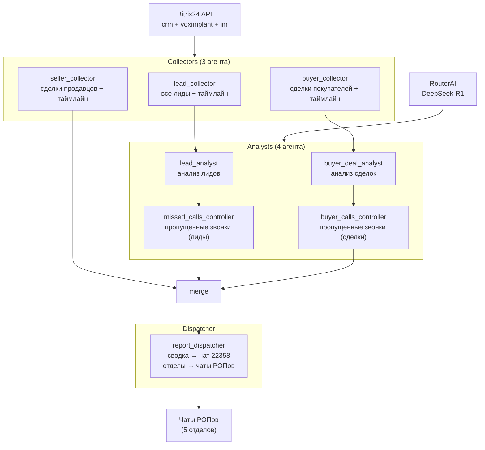

# Промпт для Cursor — Подготовка к деплою: README + DEPLOY.md

> Скопируйте содержимое ниже и отправьте в Cursor (Agent mode).
> Обновляет: `README.md`, создаёт: `DEPLOY.md`.

---

## Задача 1 — Обновить `README.md`

Полностью переписать README.md с актуальной информацией о проекте.

### Новая архитектура (mermaid)



### Обновить раздел "Деплой" — Cron

```bash
# Актуальное расписание: 10:00 и 17:00 МСК (07:00 и 14:00 UTC), пн-пт

# Вариант 1: прямой запуск на хосте
echo "0 7,14 * * 1-5 cd /opt/b24-ai-auditor && venv/bin/python src/main.py >> logs/cron.log 2>&1" | crontab -

# Вариант 2: запуск через Docker
echo "0 7,14 * * 1-5 cd /opt/b24-ai-auditor && docker run --rm --env-file .env -v \$(pwd)/logs:/app/logs b24-ai-auditor:latest >> logs/cron.log 2>&1" | crontab -
```

### Обновить таблицу переменных окружения

Добавить недостающие переменные: `REPORT_SINCE`, `BUYERS_CATEGORY_ID`, `SELLERS_CATEGORY_ID`.

| Переменная | Описание |
|---|---|
| `B24_WEBHOOK_URL` | URL входящего вебхука Битрикс24 |
| `B24_USER_ID` | ID пользователя для API-запросов |
| `BUYERS_CATEGORY_ID` | ID воронки покупателей (по умолчанию 18) |
| `SELLERS_CATEGORY_ID` | ID воронки продавцов (по умолчанию 0) |
| `REPORT_SINCE` | Дата начала отчётного периода (YYYY-MM-DD) |
| `ROUTERAI_API_KEY` | API-ключ RouterAI |
| `ROUTERAI_BASE_URL` | Базовый URL RouterAI |
| `ROUTERAI_R1_MODEL` | Модель для аналитиков (deepseek/deepseek-v4-flash) |
| `ROUTERAI_V3_MODEL` | Модель (deepseek/deepseek-v4-flash) |
| `DRY_RUN` | `true` — только чтение, без мутаций |
| `LOG_LEVEL` | Уровень логирования (INFO, DEBUG) |
| `MANAGEMENT_CHAT_ID` | ID чата для сводных отчётов |
| `ADMIN_USER_ID` | ID админа для экстренных уведомлений |

### Обновить структуру проекта

```
b24-ai-auditor/
├── src/
│   ├── config.py          # Pydantic Settings
│   ├── main.py            # Точка входа
│   ├── tools.py           # Инструменты (Bitrix24 API + звонки)
│   ├── graph.py           # LangGraph граф v2
│   ├── prompts.py         # Системные промпты
│   └── notify.py          # Отправка уведомлений в Bitrix24
├── tests/
├── logs/
├── plans/prompts/         # Промпты для Cursor (step-01..47)
├── Dockerfile
├── docker-compose.yml
├── crontab.txt
├── Makefile
├── make.cmd
├── requirements.txt
├── requirements-dev.txt
├── DEPLOY.md
└── README.md
```

---

## Задача 2 — Создать `DEPLOY.md`

Чеклист деплоя на сервер:

```markdown
# Деплой b24-ai-auditor на сервер

## 1. Подготовка сервера

```bash
# Установить Docker (если нет)
curl -fsSL https://get.docker.com | sh
sudo usermod -aG docker $USER
```

## 2. Клонирование и настройка

```bash
cd /opt
git clone <repo-url> b24-ai-auditor
cd b24-ai-auditor

# Создать .env из примера
cp .env.example .env
nano .env  # Вставить реальные ключи и URL
```

**Важно:** в `.env` установить:
- `DRY_RUN=false`
- `LOG_LEVEL=INFO`
- `REPORT_SINCE=2026-06-02` (или актуальную дату)

## 3. Сборка Docker-образа

```bash
docker build -t b24-ai-auditor:latest .
```

## 4. Тестовый запуск

```bash
# Dry-run (без мутаций в CRM)
docker run --rm --env-file .env \
  -e DRY_RUN=true \
  -v $(pwd)/logs:/app/logs \
  b24-ai-auditor:latest

# Проверить логи
tail -100 logs/audit.log
```

## 5. Установка cron

```bash
# Активировать crontab (10:00 и 17:00 МСК, пн-пт)
crontab crontab.txt

# Проверить
crontab -l
```

## 6. Мониторинг

```bash
# Логи аудита
tail -f /opt/b24-ai-auditor/logs/audit.log

# Логи cron
tail -f /opt/b24-ai-auditor/logs/cron.log
```

## 7. Обновление

```bash
cd /opt/b24-ai-auditor
git pull
docker build -t b24-ai-auditor:latest .
# Cron продолжит использовать новый образ
```

## 8. Откат

```bash
cd /opt/b24-ai-auditor
git checkout <previous-commit>
docker build -t b24-ai-auditor:latest .
```
```

---

## Проверка

1. `README.md` — актуальная архитектура v2, cron 10:00/17:00, все переменные
2. `DEPLOY.md` — полный чеклист деплоя
3. `.\make.cmd lint` — не должно быть ошибок
